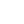

    <tr><td align="center">1</td><td align="center"></td><td><code>dashboard</code></td><td align="center"><a href="https://github.com/Haijo12/roblox-icons/blob/main/icons-pack/material-pack/white/d/dashboard.png">↗</a></td></tr>
    <tr><td align="center">2</td><td align="center"></td><td><code>data_usage</code></td><td align="center"><a href="https://github.com/Haijo12/roblox-icons/blob/main/icons-pack/material-pack/white/d/data_usage.png">↗</a></td></tr>
    <tr><td align="center">3</td><td align="center"></td><td><code>date_range</code></td><td align="center"><a href="https://github.com/Haijo12/roblox-icons/blob/main/icons-pack/material-pack/white/d/date_range.png">↗</a></td></tr>
    <tr><td align="center">4</td><td align="center"></td><td><code>deck</code></td><td align="center"><a href="https://github.com/Haijo12/roblox-icons/blob/main/icons-pack/material-pack/white/d/deck.png">↗</a></td></tr>
    <tr><td align="center">5</td><td align="center"></td><td><code>dehaze</code></td><td align="center"><a href="https://github.com/Haijo12/roblox-icons/blob/main/icons-pack/material-pack/white/d/dehaze.png">↗</a></td></tr>
    <tr><td align="center">6</td><td align="center"></td><td><code>delete</code></td><td align="center"><a href="https://github.com/Haijo12/roblox-icons/blob/main/icons-pack/material-pack/white/d/delete.png">↗</a></td></tr>
    <tr><td align="center">7</td><td align="center"></td><td><code>delete_forever</code></td><td align="center"><a href="https://github.com/Haijo12/roblox-icons/blob/main/icons-pack/material-pack/white/d/delete_forever.png">↗</a></td></tr>
    <tr><td align="center">8</td><td align="center"></td><td><code>delete_outline</code></td><td align="center"><a href="https://github.com/Haijo12/roblox-icons/blob/main/icons-pack/material-pack/white/d/delete_outline.png">↗</a></td></tr>
    <tr><td align="center">9</td><td align="center"></td><td><code>delete_sweep</code></td><td align="center"><a href="https://github.com/Haijo12/roblox-icons/blob/main/icons-pack/material-pack/white/d/delete_sweep.png">↗</a></td></tr>
    <tr><td align="center">10</td><td align="center"></td><td><code>departure_board</code></td><td align="center"><a href="https://github.com/Haijo12/roblox-icons/blob/main/icons-pack/material-pack/white/d/departure_board.png">↗</a></td></tr>
    <tr><td align="center">11</td><td align="center"></td><td><code>description</code></td><td align="center"><a href="https://github.com/Haijo12/roblox-icons/blob/main/icons-pack/material-pack/white/d/description.png">↗</a></td></tr>
    <tr><td align="center">12</td><td align="center"></td><td><code>desktop_access_disabled</code></td><td align="center"><a href="https://github.com/Haijo12/roblox-icons/blob/main/icons-pack/material-pack/white/d/desktop_access_disabled.png">↗</a></td></tr>
    <tr><td align="center">13</td><td align="center"></td><td><code>desktop_mac</code></td><td align="center"><a href="https://github.com/Haijo12/roblox-icons/blob/main/icons-pack/material-pack/white/d/desktop_mac.png">↗</a></td></tr>
    <tr><td align="center">14</td><td align="center"></td><td><code>desktop_windows</code></td><td align="center"><a href="https://github.com/Haijo12/roblox-icons/blob/main/icons-pack/material-pack/white/d/desktop_windows.png">↗</a></td></tr>
    <tr><td align="center">15</td><td align="center"></td><td><code>details</code></td><td align="center"><a href="https://github.com/Haijo12/roblox-icons/blob/main/icons-pack/material-pack/white/d/details.png">↗</a></td></tr>
    <tr><td align="center">16</td><td align="center"></td><td><code>developer_board</code></td><td align="center"><a href="https://github.com/Haijo12/roblox-icons/blob/main/icons-pack/material-pack/white/d/developer_board.png">↗</a></td></tr>
    <tr><td align="center">17</td><td align="center"></td><td><code>developer_mode</code></td><td align="center"><a href="https://github.com/Haijo12/roblox-icons/blob/main/icons-pack/material-pack/white/d/developer_mode.png">↗</a></td></tr>
    <tr><td align="center">18</td><td align="center"></td><td><code>device_hub</code></td><td align="center"><a href="https://github.com/Haijo12/roblox-icons/blob/main/icons-pack/material-pack/white/d/device_hub.png">↗</a></td></tr>
    <tr><td align="center">19</td><td align="center"></td><td><code>device_unknown</code></td><td align="center"><a href="https://github.com/Haijo12/roblox-icons/blob/main/icons-pack/material-pack/white/d/device_unknown.png">↗</a></td></tr>
    <tr><td align="center">20</td><td align="center"></td><td><code>devices</code></td><td align="center"><a href="https://github.com/Haijo12/roblox-icons/blob/main/icons-pack/material-pack/white/d/devices.png">↗</a></td></tr>
    <tr><td align="center">21</td><td align="center"></td><td><code>devices_other</code></td><td align="center"><a href="https://github.com/Haijo12/roblox-icons/blob/main/icons-pack/material-pack/white/d/devices_other.png">↗</a></td></tr>
    <tr><td align="center">22</td><td align="center"></td><td><code>dialer_sip</code></td><td align="center"><a href="https://github.com/Haijo12/roblox-icons/blob/main/icons-pack/material-pack/white/d/dialer_sip.png">↗</a></td></tr>
    <tr><td align="center">23</td><td align="center"></td><td><code>dialpad</code></td><td align="center"><a href="https://github.com/Haijo12/roblox-icons/blob/main/icons-pack/material-pack/white/d/dialpad.png">↗</a></td></tr>
    <tr><td align="center">24</td><td align="center"></td><td><code>directions</code></td><td align="center"><a href="https://github.com/Haijo12/roblox-icons/blob/main/icons-pack/material-pack/white/d/directions.png">↗</a></td></tr>
    <tr><td align="center">25</td><td align="center"></td><td><code>directions_bike</code></td><td align="center"><a href="https://github.com/Haijo12/roblox-icons/blob/main/icons-pack/material-pack/white/d/directions_bike.png">↗</a></td></tr>
    <tr><td align="center">26</td><td align="center"></td><td><code>directions_boat</code></td><td align="center"><a href="https://github.com/Haijo12/roblox-icons/blob/main/icons-pack/material-pack/white/d/directions_boat.png">↗</a></td></tr>
    <tr><td align="center">27</td><td align="center"></td><td><code>directions_bus</code></td><td align="center"><a href="https://github.com/Haijo12/roblox-icons/blob/main/icons-pack/material-pack/white/d/directions_bus.png">↗</a></td></tr>
    <tr><td align="center">28</td><td align="center"></td><td><code>directions_car</code></td><td align="center"><a href="https://github.com/Haijo12/roblox-icons/blob/main/icons-pack/material-pack/white/d/directions_car.png">↗</a></td></tr>
    <tr><td align="center">29</td><td align="center"></td><td><code>directions_railway</code></td><td align="center"><a href="https://github.com/Haijo12/roblox-icons/blob/main/icons-pack/material-pack/white/d/directions_railway.png">↗</a></td></tr>
    <tr><td align="center">30</td><td align="center"></td><td><code>directions_run</code></td><td align="center"><a href="https://github.com/Haijo12/roblox-icons/blob/main/icons-pack/material-pack/white/d/directions_run.png">↗</a></td></tr>
    <tr><td align="center">31</td><td align="center"></td><td><code>directions_subway</code></td><td align="center"><a href="https://github.com/Haijo12/roblox-icons/blob/main/icons-pack/material-pack/white/d/directions_subway.png">↗</a></td></tr>
    <tr><td align="center">32</td><td align="center"></td><td><code>directions_transit</code></td><td align="center"><a href="https://github.com/Haijo12/roblox-icons/blob/main/icons-pack/material-pack/white/d/directions_transit.png">↗</a></td></tr>
    <tr><td align="center">33</td><td align="center"></td><td><code>directions_walk</code></td><td align="center"><a href="https://github.com/Haijo12/roblox-icons/blob/main/icons-pack/material-pack/white/d/directions_walk.png">↗</a></td></tr>
    <tr><td align="center">34</td><td align="center"></td><td><code>disc_full</code></td><td align="center"><a href="https://github.com/Haijo12/roblox-icons/blob/main/icons-pack/material-pack/white/d/disc_full.png">↗</a></td></tr>
    <tr><td align="center">35</td><td align="center"></td><td><code>divide</code></td><td align="center"><a href="https://github.com/Haijo12/roblox-icons/blob/main/icons-pack/material-pack/white/d/divide.png">↗</a></td></tr>
    <tr><td align="center">36</td><td align="center"></td><td><code>dns</code></td><td align="center"><a href="https://github.com/Haijo12/roblox-icons/blob/main/icons-pack/material-pack/white/d/dns.png">↗</a></td></tr>
    <tr><td align="center">37</td><td align="center"></td><td><code>do_not_disturb</code></td><td align="center"><a href="https://github.com/Haijo12/roblox-icons/blob/main/icons-pack/material-pack/white/d/do_not_disturb.png">↗</a></td></tr>
    <tr><td align="center">38</td><td align="center"></td><td><code>do_not_disturb_alt</code></td><td align="center"><a href="https://github.com/Haijo12/roblox-icons/blob/main/icons-pack/material-pack/white/d/do_not_disturb_alt.png">↗</a></td></tr>
    <tr><td align="center">39</td><td align="center"></td><td><code>do_not_disturb_off</code></td><td align="center"><a href="https://github.com/Haijo12/roblox-icons/blob/main/icons-pack/material-pack/white/d/do_not_disturb_off.png">↗</a></td></tr>
    <tr><td align="center">40</td><td align="center"></td><td><code>dock</code></td><td align="center"><a href="https://github.com/Haijo12/roblox-icons/blob/main/icons-pack/material-pack/white/d/dock.png">↗</a></td></tr>
    <tr><td align="center">41</td><td align="center"></td><td><code>domain</code></td><td align="center"><a href="https://github.com/Haijo12/roblox-icons/blob/main/icons-pack/material-pack/white/d/domain.png">↗</a></td></tr>
    <tr><td align="center">42</td><td align="center"></td><td><code>domain_disabled</code></td><td align="center"><a href="https://github.com/Haijo12/roblox-icons/blob/main/icons-pack/material-pack/white/d/domain_disabled.png">↗</a></td></tr>
    <tr><td align="center">43</td><td align="center"></td><td><code>done</code></td><td align="center"><a href="https://github.com/Haijo12/roblox-icons/blob/main/icons-pack/material-pack/white/d/done.png">↗</a></td></tr>
    <tr><td align="center">44</td><td align="center"></td><td><code>done_all</code></td><td align="center"><a href="https://github.com/Haijo12/roblox-icons/blob/main/icons-pack/material-pack/white/d/done_all.png">↗</a></td></tr>
    <tr><td align="center">45</td><td align="center"></td><td><code>done_outline</code></td><td align="center"><a href="https://github.com/Haijo12/roblox-icons/blob/main/icons-pack/material-pack/white/d/done_outline.png">↗</a></td></tr>
    <tr><td align="center">46</td><td align="center"></td><td><code>donut_large</code></td><td align="center"><a href="https://github.com/Haijo12/roblox-icons/blob/main/icons-pack/material-pack/white/d/donut_large.png">↗</a></td></tr>
    <tr><td align="center">47</td><td align="center"></td><td><code>donut_small</code></td><td align="center"><a href="https://github.com/Haijo12/roblox-icons/blob/main/icons-pack/material-pack/white/d/donut_small.png">↗</a></td></tr>
    <tr><td align="center">48</td><td align="center"></td><td><code>double_arrow</code></td><td align="center"><a href="https://github.com/Haijo12/roblox-icons/blob/main/icons-pack/material-pack/white/d/double_arrow.png">↗</a></td></tr>
    <tr><td align="center">49</td><td align="center"></td><td><code>drafts</code></td><td align="center"><a href="https://github.com/Haijo12/roblox-icons/blob/main/icons-pack/material-pack/white/d/drafts.png">↗</a></td></tr>
    <tr><td align="center">50</td><td align="center"></td><td><code>drag_handle</code></td><td align="center"><a href="https://github.com/Haijo12/roblox-icons/blob/main/icons-pack/material-pack/white/d/drag_handle.png">↗</a></td></tr>
    <tr><td align="center">51</td><td align="center"></td><td><code>drag_indicator</code></td><td align="center"><a href="https://github.com/Haijo12/roblox-icons/blob/main/icons-pack/material-pack/white/d/drag_indicator.png">↗</a></td></tr>
    <tr><td align="center">52</td><td align="center"></td><td><code>drive_eta</code></td><td align="center"><a href="https://github.com/Haijo12/roblox-icons/blob/main/icons-pack/material-pack/white/d/drive_eta.png">↗</a></td></tr>
    <tr><td align="center">53</td><td align="center"></td><td><code>duo</code></td><td align="center"><a href="https://github.com/Haijo12/roblox-icons/blob/main/icons-pack/material-pack/white/d/duo.png">↗</a></td></tr>
    <tr><td align="center">54</td><td align="center"></td><td><code>dvr</code></td><td align="center"><a href="https://github.com/Haijo12/roblox-icons/blob/main/icons-pack/material-pack/white/d/dvr.png">↗</a></td></tr>
    <tr><td align="center">55</td><td align="center"></td><td><code>dynamic_feed</code></td><td align="center"><a href="https://github.com/Haijo12/roblox-icons/blob/main/icons-pack/material-pack/white/d/dynamic_feed.png">↗</a></td></tr>
  </tbody>
</table>
