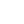

    <tr><td align="center">1</td><td align="center"></td><td><code>eco</code></td><td align="center"><a href="https://github.com/Haijo12/roblox-icons/blob/main/icons-pack/material-pack/white/e/eco.png">↗</a></td></tr>
    <tr><td align="center">2</td><td align="center"></td><td><code>edit</code></td><td align="center"><a href="https://github.com/Haijo12/roblox-icons/blob/main/icons-pack/material-pack/white/e/edit.png">↗</a></td></tr>
    <tr><td align="center">3</td><td align="center"></td><td><code>edit_attributes</code></td><td align="center"><a href="https://github.com/Haijo12/roblox-icons/blob/main/icons-pack/material-pack/white/e/edit_attributes.png">↗</a></td></tr>
    <tr><td align="center">4</td><td align="center"></td><td><code>edit_location</code></td><td align="center"><a href="https://github.com/Haijo12/roblox-icons/blob/main/icons-pack/material-pack/white/e/edit_location.png">↗</a></td></tr>
    <tr><td align="center">5</td><td align="center"></td><td><code>eject</code></td><td align="center"><a href="https://github.com/Haijo12/roblox-icons/blob/main/icons-pack/material-pack/white/e/eject.png">↗</a></td></tr>
    <tr><td align="center">6</td><td align="center"></td><td><code>email</code></td><td align="center"><a href="https://github.com/Haijo12/roblox-icons/blob/main/icons-pack/material-pack/white/e/email.png">↗</a></td></tr>
    <tr><td align="center">7</td><td align="center"></td><td><code>emoji_emotions</code></td><td align="center"><a href="https://github.com/Haijo12/roblox-icons/blob/main/icons-pack/material-pack/white/e/emoji_emotions.png">↗</a></td></tr>
    <tr><td align="center">8</td><td align="center"></td><td><code>emoji_events</code></td><td align="center"><a href="https://github.com/Haijo12/roblox-icons/blob/main/icons-pack/material-pack/white/e/emoji_events.png">↗</a></td></tr>
    <tr><td align="center">9</td><td align="center"></td><td><code>emoji_flags</code></td><td align="center"><a href="https://github.com/Haijo12/roblox-icons/blob/main/icons-pack/material-pack/white/e/emoji_flags.png">↗</a></td></tr>
    <tr><td align="center">10</td><td align="center"></td><td><code>emoji_food_beverage</code></td><td align="center"><a href="https://github.com/Haijo12/roblox-icons/blob/main/icons-pack/material-pack/white/e/emoji_food_beverage.png">↗</a></td></tr>
    <tr><td align="center">11</td><td align="center"></td><td><code>emoji_nature</code></td><td align="center"><a href="https://github.com/Haijo12/roblox-icons/blob/main/icons-pack/material-pack/white/e/emoji_nature.png">↗</a></td></tr>
    <tr><td align="center">12</td><td align="center"></td><td><code>emoji_objects</code></td><td align="center"><a href="https://github.com/Haijo12/roblox-icons/blob/main/icons-pack/material-pack/white/e/emoji_objects.png">↗</a></td></tr>
    <tr><td align="center">13</td><td align="center"></td><td><code>emoji_people</code></td><td align="center"><a href="https://github.com/Haijo12/roblox-icons/blob/main/icons-pack/material-pack/white/e/emoji_people.png">↗</a></td></tr>
    <tr><td align="center">14</td><td align="center"></td><td><code>emoji_symbols</code></td><td align="center"><a href="https://github.com/Haijo12/roblox-icons/blob/main/icons-pack/material-pack/white/e/emoji_symbols.png">↗</a></td></tr>
    <tr><td align="center">15</td><td align="center"></td><td><code>emoji_transportation</code></td><td align="center"><a href="https://github.com/Haijo12/roblox-icons/blob/main/icons-pack/material-pack/white/e/emoji_transportation.png">↗</a></td></tr>
    <tr><td align="center">16</td><td align="center"></td><td><code>enhanced_encryption</code></td><td align="center"><a href="https://github.com/Haijo12/roblox-icons/blob/main/icons-pack/material-pack/white/e/enhanced_encryption.png">↗</a></td></tr>
    <tr><td align="center">17</td><td align="center"></td><td><code>equalizer</code></td><td align="center"><a href="https://github.com/Haijo12/roblox-icons/blob/main/icons-pack/material-pack/white/e/equalizer.png">↗</a></td></tr>
    <tr><td align="center">18</td><td align="center"></td><td><code>equals</code></td><td align="center"><a href="https://github.com/Haijo12/roblox-icons/blob/main/icons-pack/material-pack/white/e/equals.png">↗</a></td></tr>
    <tr><td align="center">19</td><td align="center"></td><td><code>error</code></td><td align="center"><a href="https://github.com/Haijo12/roblox-icons/blob/main/icons-pack/material-pack/white/e/error.png">↗</a></td></tr>
    <tr><td align="center">20</td><td align="center"></td><td><code>error_outline</code></td><td align="center"><a href="https://github.com/Haijo12/roblox-icons/blob/main/icons-pack/material-pack/white/e/error_outline.png">↗</a></td></tr>
    <tr><td align="center">21</td><td align="center"></td><td><code>euro</code></td><td align="center"><a href="https://github.com/Haijo12/roblox-icons/blob/main/icons-pack/material-pack/white/e/euro.png">↗</a></td></tr>
    <tr><td align="center">22</td><td align="center"></td><td><code>euro_symbol</code></td><td align="center"><a href="https://github.com/Haijo12/roblox-icons/blob/main/icons-pack/material-pack/white/e/euro_symbol.png">↗</a></td></tr>
    <tr><td align="center">23</td><td align="center"></td><td><code>ev_station</code></td><td align="center"><a href="https://github.com/Haijo12/roblox-icons/blob/main/icons-pack/material-pack/white/e/ev_station.png">↗</a></td></tr>
    <tr><td align="center">24</td><td align="center"></td><td><code>event</code></td><td align="center"><a href="https://github.com/Haijo12/roblox-icons/blob/main/icons-pack/material-pack/white/e/event.png">↗</a></td></tr>
    <tr><td align="center">25</td><td align="center"></td><td><code>event_available</code></td><td align="center"><a href="https://github.com/Haijo12/roblox-icons/blob/main/icons-pack/material-pack/white/e/event_available.png">↗</a></td></tr>
    <tr><td align="center">26</td><td align="center"></td><td><code>event_busy</code></td><td align="center"><a href="https://github.com/Haijo12/roblox-icons/blob/main/icons-pack/material-pack/white/e/event_busy.png">↗</a></td></tr>
    <tr><td align="center">27</td><td align="center"></td><td><code>event_note</code></td><td align="center"><a href="https://github.com/Haijo12/roblox-icons/blob/main/icons-pack/material-pack/white/e/event_note.png">↗</a></td></tr>
    <tr><td align="center">28</td><td align="center"></td><td><code>event_seat</code></td><td align="center"><a href="https://github.com/Haijo12/roblox-icons/blob/main/icons-pack/material-pack/white/e/event_seat.png">↗</a></td></tr>
    <tr><td align="center">29</td><td align="center"></td><td><code>exit_to_app</code></td><td align="center"><a href="https://github.com/Haijo12/roblox-icons/blob/main/icons-pack/material-pack/white/e/exit_to_app.png">↗</a></td></tr>
    <tr><td align="center">30</td><td align="center"></td><td><code>expand_less</code></td><td align="center"><a href="https://github.com/Haijo12/roblox-icons/blob/main/icons-pack/material-pack/white/e/expand_less.png">↗</a></td></tr>
    <tr><td align="center">31</td><td align="center"></td><td><code>expand_more</code></td><td align="center"><a href="https://github.com/Haijo12/roblox-icons/blob/main/icons-pack/material-pack/white/e/expand_more.png">↗</a></td></tr>
    <tr><td align="center">32</td><td align="center"></td><td><code>explicit</code></td><td align="center"><a href="https://github.com/Haijo12/roblox-icons/blob/main/icons-pack/material-pack/white/e/explicit.png">↗</a></td></tr>
    <tr><td align="center">33</td><td align="center"></td><td><code>explore</code></td><td align="center"><a href="https://github.com/Haijo12/roblox-icons/blob/main/icons-pack/material-pack/white/e/explore.png">↗</a></td></tr>
    <tr><td align="center">34</td><td align="center"></td><td><code>explore_off</code></td><td align="center"><a href="https://github.com/Haijo12/roblox-icons/blob/main/icons-pack/material-pack/white/e/explore_off.png">↗</a></td></tr>
    <tr><td align="center">35</td><td align="center"></td><td><code>exposure</code></td><td align="center"><a href="https://github.com/Haijo12/roblox-icons/blob/main/icons-pack/material-pack/white/e/exposure.png">↗</a></td></tr>
    <tr><td align="center">36</td><td align="center"></td><td><code>exposure_neg_1</code></td><td align="center"><a href="https://github.com/Haijo12/roblox-icons/blob/main/icons-pack/material-pack/white/e/exposure_neg_1.png">↗</a></td></tr>
    <tr><td align="center">37</td><td align="center"></td><td><code>exposure_neg_2</code></td><td align="center"><a href="https://github.com/Haijo12/roblox-icons/blob/main/icons-pack/material-pack/white/e/exposure_neg_2.png">↗</a></td></tr>
    <tr><td align="center">38</td><td align="center"></td><td><code>exposure_plus_1</code></td><td align="center"><a href="https://github.com/Haijo12/roblox-icons/blob/main/icons-pack/material-pack/white/e/exposure_plus_1.png">↗</a></td></tr>
    <tr><td align="center">39</td><td align="center"></td><td><code>exposure_plus_2</code></td><td align="center"><a href="https://github.com/Haijo12/roblox-icons/blob/main/icons-pack/material-pack/white/e/exposure_plus_2.png">↗</a></td></tr>
    <tr><td align="center">40</td><td align="center"></td><td><code>exposure_zero</code></td><td align="center"><a href="https://github.com/Haijo12/roblox-icons/blob/main/icons-pack/material-pack/white/e/exposure_zero.png">↗</a></td></tr>
    <tr><td align="center">41</td><td align="center"></td><td><code>extension</code></td><td align="center"><a href="https://github.com/Haijo12/roblox-icons/blob/main/icons-pack/material-pack/white/e/extension.png">↗</a></td></tr>
  </tbody>
</table>
