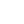

    <tr><td align="center">1</td><td align="center"></td><td><code>radio</code></td><td align="center"><a href="https://github.com/Haijo12/roblox-icons/blob/main/icons-pack/material-pack/white/r/radio.png">↗</a></td></tr>
    <tr><td align="center">2</td><td align="center"></td><td><code>radio_button_checked</code></td><td align="center"><a href="https://github.com/Haijo12/roblox-icons/blob/main/icons-pack/material-pack/white/r/radio_button_checked.png">↗</a></td></tr>
    <tr><td align="center">3</td><td align="center"></td><td><code>radio_button_unchecked</code></td><td align="center"><a href="https://github.com/Haijo12/roblox-icons/blob/main/icons-pack/material-pack/white/r/radio_button_unchecked.png">↗</a></td></tr>
    <tr><td align="center">4</td><td align="center"></td><td><code>rate_review</code></td><td align="center"><a href="https://github.com/Haijo12/roblox-icons/blob/main/icons-pack/material-pack/white/r/rate_review.png">↗</a></td></tr>
    <tr><td align="center">5</td><td align="center"></td><td><code>receipt</code></td><td align="center"><a href="https://github.com/Haijo12/roblox-icons/blob/main/icons-pack/material-pack/white/r/receipt.png">↗</a></td></tr>
    <tr><td align="center">6</td><td align="center"></td><td><code>recent_actors</code></td><td align="center"><a href="https://github.com/Haijo12/roblox-icons/blob/main/icons-pack/material-pack/white/r/recent_actors.png">↗</a></td></tr>
    <tr><td align="center">7</td><td align="center"></td><td><code>record_voice_over</code></td><td align="center"><a href="https://github.com/Haijo12/roblox-icons/blob/main/icons-pack/material-pack/white/r/record_voice_over.png">↗</a></td></tr>
    <tr><td align="center">8</td><td align="center"></td><td><code>redeem</code></td><td align="center"><a href="https://github.com/Haijo12/roblox-icons/blob/main/icons-pack/material-pack/white/r/redeem.png">↗</a></td></tr>
    <tr><td align="center">9</td><td align="center"></td><td><code>redo</code></td><td align="center"><a href="https://github.com/Haijo12/roblox-icons/blob/main/icons-pack/material-pack/white/r/redo.png">↗</a></td></tr>
    <tr><td align="center">10</td><td align="center"></td><td><code>refresh</code></td><td align="center"><a href="https://github.com/Haijo12/roblox-icons/blob/main/icons-pack/material-pack/white/r/refresh.png">↗</a></td></tr>
    <tr><td align="center">11</td><td align="center"></td><td><code>remove</code></td><td align="center"><a href="https://github.com/Haijo12/roblox-icons/blob/main/icons-pack/material-pack/white/r/remove.png">↗</a></td></tr>
    <tr><td align="center">12</td><td align="center"></td><td><code>remove_circle</code></td><td align="center"><a href="https://github.com/Haijo12/roblox-icons/blob/main/icons-pack/material-pack/white/r/remove_circle.png">↗</a></td></tr>
    <tr><td align="center">13</td><td align="center"></td><td><code>remove_circle_outline</code></td><td align="center"><a href="https://github.com/Haijo12/roblox-icons/blob/main/icons-pack/material-pack/white/r/remove_circle_outline.png">↗</a></td></tr>
    <tr><td align="center">14</td><td align="center"></td><td><code>remove_from_queue</code></td><td align="center"><a href="https://github.com/Haijo12/roblox-icons/blob/main/icons-pack/material-pack/white/r/remove_from_queue.png">↗</a></td></tr>
    <tr><td align="center">15</td><td align="center"></td><td><code>remove_red_eye</code></td><td align="center"><a href="https://github.com/Haijo12/roblox-icons/blob/main/icons-pack/material-pack/white/r/remove_red_eye.png">↗</a></td></tr>
    <tr><td align="center">16</td><td align="center"></td><td><code>remove_shopping_cart</code></td><td align="center"><a href="https://github.com/Haijo12/roblox-icons/blob/main/icons-pack/material-pack/white/r/remove_shopping_cart.png">↗</a></td></tr>
    <tr><td align="center">17</td><td align="center"></td><td><code>reorder</code></td><td align="center"><a href="https://github.com/Haijo12/roblox-icons/blob/main/icons-pack/material-pack/white/r/reorder.png">↗</a></td></tr>
    <tr><td align="center">18</td><td align="center"></td><td><code>repeat</code></td><td align="center"><a href="https://github.com/Haijo12/roblox-icons/blob/main/icons-pack/material-pack/white/r/repeat.png">↗</a></td></tr>
    <tr><td align="center">19</td><td align="center"></td><td><code>repeat_one</code></td><td align="center"><a href="https://github.com/Haijo12/roblox-icons/blob/main/icons-pack/material-pack/white/r/repeat_one.png">↗</a></td></tr>
    <tr><td align="center">20</td><td align="center"></td><td><code>replay</code></td><td align="center"><a href="https://github.com/Haijo12/roblox-icons/blob/main/icons-pack/material-pack/white/r/replay.png">↗</a></td></tr>
    <tr><td align="center">21</td><td align="center"></td><td><code>replay_10</code></td><td align="center"><a href="https://github.com/Haijo12/roblox-icons/blob/main/icons-pack/material-pack/white/r/replay_10.png">↗</a></td></tr>
    <tr><td align="center">22</td><td align="center"></td><td><code>replay_30</code></td><td align="center"><a href="https://github.com/Haijo12/roblox-icons/blob/main/icons-pack/material-pack/white/r/replay_30.png">↗</a></td></tr>
    <tr><td align="center">23</td><td align="center"></td><td><code>replay_5</code></td><td align="center"><a href="https://github.com/Haijo12/roblox-icons/blob/main/icons-pack/material-pack/white/r/replay_5.png">↗</a></td></tr>
    <tr><td align="center">24</td><td align="center"></td><td><code>reply</code></td><td align="center"><a href="https://github.com/Haijo12/roblox-icons/blob/main/icons-pack/material-pack/white/r/reply.png">↗</a></td></tr>
    <tr><td align="center">25</td><td align="center"></td><td><code>reply_all</code></td><td align="center"><a href="https://github.com/Haijo12/roblox-icons/blob/main/icons-pack/material-pack/white/r/reply_all.png">↗</a></td></tr>
    <tr><td align="center">26</td><td align="center"></td><td><code>report</code></td><td align="center"><a href="https://github.com/Haijo12/roblox-icons/blob/main/icons-pack/material-pack/white/r/report.png">↗</a></td></tr>
    <tr><td align="center">27</td><td align="center"></td><td><code>report_off</code></td><td align="center"><a href="https://github.com/Haijo12/roblox-icons/blob/main/icons-pack/material-pack/white/r/report_off.png">↗</a></td></tr>
    <tr><td align="center">28</td><td align="center"></td><td><code>report_problem</code></td><td align="center"><a href="https://github.com/Haijo12/roblox-icons/blob/main/icons-pack/material-pack/white/r/report_problem.png">↗</a></td></tr>
    <tr><td align="center">29</td><td align="center"></td><td><code>restaurant</code></td><td align="center"><a href="https://github.com/Haijo12/roblox-icons/blob/main/icons-pack/material-pack/white/r/restaurant.png">↗</a></td></tr>
    <tr><td align="center">30</td><td align="center"></td><td><code>restaurant_menu</code></td><td align="center"><a href="https://github.com/Haijo12/roblox-icons/blob/main/icons-pack/material-pack/white/r/restaurant_menu.png">↗</a></td></tr>
    <tr><td align="center">31</td><td align="center"></td><td><code>restore</code></td><td align="center"><a href="https://github.com/Haijo12/roblox-icons/blob/main/icons-pack/material-pack/white/r/restore.png">↗</a></td></tr>
    <tr><td align="center">32</td><td align="center"></td><td><code>restore_from_trash</code></td><td align="center"><a href="https://github.com/Haijo12/roblox-icons/blob/main/icons-pack/material-pack/white/r/restore_from_trash.png">↗</a></td></tr>
    <tr><td align="center">33</td><td align="center"></td><td><code>restore_page</code></td><td align="center"><a href="https://github.com/Haijo12/roblox-icons/blob/main/icons-pack/material-pack/white/r/restore_page.png">↗</a></td></tr>
    <tr><td align="center">34</td><td align="center"></td><td><code>ring_volume</code></td><td align="center"><a href="https://github.com/Haijo12/roblox-icons/blob/main/icons-pack/material-pack/white/r/ring_volume.png">↗</a></td></tr>
    <tr><td align="center">35</td><td align="center"></td><td><code>rocket</code></td><td align="center"><a href="https://github.com/Haijo12/roblox-icons/blob/main/icons-pack/material-pack/white/r/rocket.png">↗</a></td></tr>
    <tr><td align="center">36</td><td align="center"></td><td><code>room</code></td><td align="center"><a href="https://github.com/Haijo12/roblox-icons/blob/main/icons-pack/material-pack/white/r/room.png">↗</a></td></tr>
    <tr><td align="center">37</td><td align="center"></td><td><code>room_service</code></td><td align="center"><a href="https://github.com/Haijo12/roblox-icons/blob/main/icons-pack/material-pack/white/r/room_service.png">↗</a></td></tr>
    <tr><td align="center">38</td><td align="center"></td><td><code>rotate_90_degrees_ccw</code></td><td align="center"><a href="https://github.com/Haijo12/roblox-icons/blob/main/icons-pack/material-pack/white/r/rotate_90_degrees_ccw.png">↗</a></td></tr>
    <tr><td align="center">39</td><td align="center"></td><td><code>rotate_left</code></td><td align="center"><a href="https://github.com/Haijo12/roblox-icons/blob/main/icons-pack/material-pack/white/r/rotate_left.png">↗</a></td></tr>
    <tr><td align="center">40</td><td align="center"></td><td><code>rotate_right</code></td><td align="center"><a href="https://github.com/Haijo12/roblox-icons/blob/main/icons-pack/material-pack/white/r/rotate_right.png">↗</a></td></tr>
    <tr><td align="center">41</td><td align="center"></td><td><code>rounded_corner</code></td><td align="center"><a href="https://github.com/Haijo12/roblox-icons/blob/main/icons-pack/material-pack/white/r/rounded_corner.png">↗</a></td></tr>
    <tr><td align="center">42</td><td align="center"></td><td><code>router</code></td><td align="center"><a href="https://github.com/Haijo12/roblox-icons/blob/main/icons-pack/material-pack/white/r/router.png">↗</a></td></tr>
    <tr><td align="center">43</td><td align="center"></td><td><code>rowing</code></td><td align="center"><a href="https://github.com/Haijo12/roblox-icons/blob/main/icons-pack/material-pack/white/r/rowing.png">↗</a></td></tr>
    <tr><td align="center">44</td><td align="center"></td><td><code>rss_feed</code></td><td align="center"><a href="https://github.com/Haijo12/roblox-icons/blob/main/icons-pack/material-pack/white/r/rss_feed.png">↗</a></td></tr>
    <tr><td align="center">45</td><td align="center"></td><td><code>rv_hookup</code></td><td align="center"><a href="https://github.com/Haijo12/roblox-icons/blob/main/icons-pack/material-pack/white/r/rv_hookup.png">↗</a></td></tr>
  </tbody>
</table>
