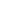

# T — Material Icons

> **58 icons** in the **T** category.

<table>
  <thead>
    <tr>
      <th align="center" width="50"><strong>#</strong></th>
      <th align="center" width="60"><strong>Icon</strong></th>
      <th align="left"><strong>Name</strong></th>
      <th align="center" width="60"><strong>File</strong></th>
    </tr>
  </thead>
  <tbody>
    <tr><td align="center">1</td><td align="center"></td><td><code>tab</code></td><td align="center"><a href="https://github.com/Haijo12/roblox-icons/blob/main/icons-pack/material-pack/white/t/tab.png">↗</a></td></tr>
    <tr><td align="center">2</td><td align="center"></td><td><code>tab_unselected</code></td><td align="center"><a href="https://github.com/Haijo12/roblox-icons/blob/main/icons-pack/material-pack/white/t/tab_unselected.png">↗</a></td></tr>
    <tr><td align="center">3</td><td align="center"></td><td><code>table_chart</code></td><td align="center"><a href="https://github.com/Haijo12/roblox-icons/blob/main/icons-pack/material-pack/white/t/table_chart.png">↗</a></td></tr>
    <tr><td align="center">4</td><td align="center"></td><td><code>tablet</code></td><td align="center"><a href="https://github.com/Haijo12/roblox-icons/blob/main/icons-pack/material-pack/white/t/tablet.png">↗</a></td></tr>
    <tr><td align="center">5</td><td align="center"></td><td><code>tablet_android</code></td><td align="center"><a href="https://github.com/Haijo12/roblox-icons/blob/main/icons-pack/material-pack/white/t/tablet_android.png">↗</a></td></tr>
    <tr><td align="center">6</td><td align="center"></td><td><code>tablet_mac</code></td><td align="center"><a href="https://github.com/Haijo12/roblox-icons/blob/main/icons-pack/material-pack/white/t/tablet_mac.png">↗</a></td></tr>
    <tr><td align="center">7</td><td align="center"></td><td><code>tag_faces</code></td><td align="center"><a href="https://github.com/Haijo12/roblox-icons/blob/main/icons-pack/material-pack/white/t/tag_faces.png">↗</a></td></tr>
    <tr><td align="center">8</td><td align="center"></td><td><code>tap_and_play</code></td><td align="center"><a href="https://github.com/Haijo12/roblox-icons/blob/main/icons-pack/material-pack/white/t/tap_and_play.png">↗</a></td></tr>
    <tr><td align="center">9</td><td align="center"></td><td><code>terrain</code></td><td align="center"><a href="https://github.com/Haijo12/roblox-icons/blob/main/icons-pack/material-pack/white/t/terrain.png">↗</a></td></tr>
    <tr><td align="center">10</td><td align="center"></td><td><code>text_fields</code></td><td align="center"><a href="https://github.com/Haijo12/roblox-icons/blob/main/icons-pack/material-pack/white/t/text_fields.png">↗</a></td></tr>
    <tr><td align="center">11</td><td align="center"></td><td><code>text_format</code></td><td align="center"><a href="https://github.com/Haijo12/roblox-icons/blob/main/icons-pack/material-pack/white/t/text_format.png">↗</a></td></tr>
    <tr><td align="center">12</td><td align="center"></td><td><code>text_rotate_up</code></td><td align="center"><a href="https://github.com/Haijo12/roblox-icons/blob/main/icons-pack/material-pack/white/t/text_rotate_up.png">↗</a></td></tr>
    <tr><td align="center">13</td><td align="center"></td><td><code>text_rotate_vertical</code></td><td align="center"><a href="https://github.com/Haijo12/roblox-icons/blob/main/icons-pack/material-pack/white/t/text_rotate_vertical.png">↗</a></td></tr>
    <tr><td align="center">14</td><td align="center"></td><td><code>text_rotation_angledown</code></td><td align="center"><a href="https://github.com/Haijo12/roblox-icons/blob/main/icons-pack/material-pack/white/t/text_rotation_angledown.png">↗</a></td></tr>
    <tr><td align="center">15</td><td align="center"></td><td><code>text_rotation_angleup</code></td><td align="center"><a href="https://github.com/Haijo12/roblox-icons/blob/main/icons-pack/material-pack/white/t/text_rotation_angleup.png">↗</a></td></tr>
    <tr><td align="center">16</td><td align="center"></td><td><code>text_rotation_down</code></td><td align="center"><a href="https://github.com/Haijo12/roblox-icons/blob/main/icons-pack/material-pack/white/t/text_rotation_down.png">↗</a></td></tr>
    <tr><td align="center">17</td><td align="center"></td><td><code>text_rotation_none</code></td><td align="center"><a href="https://github.com/Haijo12/roblox-icons/blob/main/icons-pack/material-pack/white/t/text_rotation_none.png">↗</a></td></tr>
    <tr><td align="center">18</td><td align="center"></td><td><code>textsms</code></td><td align="center"><a href="https://github.com/Haijo12/roblox-icons/blob/main/icons-pack/material-pack/white/t/textsms.png">↗</a></td></tr>
    <tr><td align="center">19</td><td align="center"></td><td><code>texture</code></td><td align="center"><a href="https://github.com/Haijo12/roblox-icons/blob/main/icons-pack/material-pack/white/t/texture.png">↗</a></td></tr>
    <tr><td align="center">20</td><td align="center"></td><td><code>theaters</code></td><td align="center"><a href="https://github.com/Haijo12/roblox-icons/blob/main/icons-pack/material-pack/white/t/theaters.png">↗</a></td></tr>
    <tr><td align="center">21</td><td align="center"></td><td><code>thumb_down</code></td><td align="center"><a href="https://github.com/Haijo12/roblox-icons/blob/main/icons-pack/material-pack/white/t/thumb_down.png">↗</a></td></tr>
    <tr><td align="center">22</td><td align="center"></td><td><code>thumb_down_alt</code></td><td align="center"><a href="https://github.com/Haijo12/roblox-icons/blob/main/icons-pack/material-pack/white/t/thumb_down_alt.png">↗</a></td></tr>
    <tr><td align="center">23</td><td align="center"></td><td><code>thumb_up</code></td><td align="center"><a href="https://github.com/Haijo12/roblox-icons/blob/main/icons-pack/material-pack/white/t/thumb_up.png">↗</a></td></tr>
    <tr><td align="center">24</td><td align="center"></td><td><code>thumb_up_alt</code></td><td align="center"><a href="https://github.com/Haijo12/roblox-icons/blob/main/icons-pack/material-pack/white/t/thumb_up_alt.png">↗</a></td></tr>
    <tr><td align="center">25</td><td align="center"></td><td><code>thumbs_up_down</code></td><td align="center"><a href="https://github.com/Haijo12/roblox-icons/blob/main/icons-pack/material-pack/white/t/thumbs_up_down.png">↗</a></td></tr>
    <tr><td align="center">26</td><td align="center"></td><td><code>time_to_leave</code></td><td align="center"><a href="https://github.com/Haijo12/roblox-icons/blob/main/icons-pack/material-pack/white/t/time_to_leave.png">↗</a></td></tr>
    <tr><td align="center">27</td><td align="center"></td><td><code>timelapse</code></td><td align="center"><a href="https://github.com/Haijo12/roblox-icons/blob/main/icons-pack/material-pack/white/t/timelapse.png">↗</a></td></tr>
    <tr><td align="center">28</td><td align="center"></td><td><code>timeline</code></td><td align="center"><a href="https://github.com/Haijo12/roblox-icons/blob/main/icons-pack/material-pack/white/t/timeline.png">↗</a></td></tr>
    <tr><td align="center">29</td><td align="center"></td><td><code>timer</code></td><td align="center"><a href="https://github.com/Haijo12/roblox-icons/blob/main/icons-pack/material-pack/white/t/timer.png">↗</a></td></tr>
    <tr><td align="center">30</td><td align="center"></td><td><code>timer_10</code></td><td align="center"><a href="https://github.com/Haijo12/roblox-icons/blob/main/icons-pack/material-pack/white/t/timer_10.png">↗</a></td></tr>
    <tr><td align="center">31</td><td align="center"></td><td><code>timer_3</code></td><td align="center"><a href="https://github.com/Haijo12/roblox-icons/blob/main/icons-pack/material-pack/white/t/timer_3.png">↗</a></td></tr>
    <tr><td align="center">32</td><td align="center"></td><td><code>timer_off</code></td><td align="center"><a href="https://github.com/Haijo12/roblox-icons/blob/main/icons-pack/material-pack/white/t/timer_off.png">↗</a></td></tr>
    <tr><td align="center">33</td><td align="center"></td><td><code>title</code></td><td align="center"><a href="https://github.com/Haijo12/roblox-icons/blob/main/icons-pack/material-pack/white/t/title.png">↗</a></td></tr>
    <tr><td align="center">34</td><td align="center"></td><td><code>toc</code></td><td align="center"><a href="https://github.com/Haijo12/roblox-icons/blob/main/icons-pack/material-pack/white/t/toc.png">↗</a></td></tr>
    <tr><td align="center">35</td><td align="center"></td><td><code>today</code></td><td align="center"><a href="https://github.com/Haijo12/roblox-icons/blob/main/icons-pack/material-pack/white/t/today.png">↗</a></td></tr>
    <tr><td align="center">36</td><td align="center"></td><td><code>toggle_off</code></td><td align="center"><a href="https://github.com/Haijo12/roblox-icons/blob/main/icons-pack/material-pack/white/t/toggle_off.png">↗</a></td></tr>
    <tr><td align="center">37</td><td align="center"></td><td><code>toggle_on</code></td><td align="center"><a href="https://github.com/Haijo12/roblox-icons/blob/main/icons-pack/material-pack/white/t/toggle_on.png">↗</a></td></tr>
    <tr><td align="center">38</td><td align="center"></td><td><code>toll</code></td><td align="center"><a href="https://github.com/Haijo12/roblox-icons/blob/main/icons-pack/material-pack/white/t/toll.png">↗</a></td></tr>
    <tr><td align="center">39</td><td align="center"></td><td><code>tonality</code></td><td align="center"><a href="https://github.com/Haijo12/roblox-icons/blob/main/icons-pack/material-pack/white/t/tonality.png">↗</a></td></tr>
    <tr><td align="center">40</td><td align="center"></td><td><code>touch_app</code></td><td align="center"><a href="https://github.com/Haijo12/roblox-icons/blob/main/icons-pack/material-pack/white/t/touch_app.png">↗</a></td></tr>
    <tr><td align="center">41</td><td align="center"></td><td><code>toys</code></td><td align="center"><a href="https://github.com/Haijo12/roblox-icons/blob/main/icons-pack/material-pack/white/t/toys.png">↗</a></td></tr>
    <tr><td align="center">42</td><td align="center"></td><td><code>track_changes</code></td><td align="center"><a href="https://github.com/Haijo12/roblox-icons/blob/main/icons-pack/material-pack/white/t/track_changes.png">↗</a></td></tr>
    <tr><td align="center">43</td><td align="center"></td><td><code>traffic</code></td><td align="center"><a href="https://github.com/Haijo12/roblox-icons/blob/main/icons-pack/material-pack/white/t/traffic.png">↗</a></td></tr>
    <tr><td align="center">44</td><td align="center"></td><td><code>train</code></td><td align="center"><a href="https://github.com/Haijo12/roblox-icons/blob/main/icons-pack/material-pack/white/t/train.png">↗</a></td></tr>
    <tr><td align="center">45</td><td align="center"></td><td><code>tram</code></td><td align="center"><a href="https://github.com/Haijo12/roblox-icons/blob/main/icons-pack/material-pack/white/t/tram.png">↗</a></td></tr>
    <tr><td align="center">46</td><td align="center"></td><td><code>transfer_within_a_station</code></td><td align="center"><a href="https://github.com/Haijo12/roblox-icons/blob/main/icons-pack/material-pack/white/t/transfer_within_a_station.png">↗</a></td></tr>
    <tr><td align="center">47</td><td align="center"></td><td><code>transform</code></td><td align="center"><a href="https://github.com/Haijo12/roblox-icons/blob/main/icons-pack/material-pack/white/t/transform.png">↗</a></td></tr>
    <tr><td align="center">48</td><td align="center"></td><td><code>transit_enterexit</code></td><td align="center"><a href="https://github.com/Haijo12/roblox-icons/blob/main/icons-pack/material-pack/white/t/transit_enterexit.png">↗</a></td></tr>
    <tr><td align="center">49</td><td align="center"></td><td><code>translate</code></td><td align="center"><a href="https://github.com/Haijo12/roblox-icons/blob/main/icons-pack/material-pack/white/t/translate.png">↗</a></td></tr>
    <tr><td align="center">50</td><td align="center"></td><td><code>trending_down</code></td><td align="center"><a href="https://github.com/Haijo12/roblox-icons/blob/main/icons-pack/material-pack/white/t/trending_down.png">↗</a></td></tr>
    <tr><td align="center">51</td><td align="center"></td><td><code>trending_flat</code></td><td align="center"><a href="https://github.com/Haijo12/roblox-icons/blob/main/icons-pack/material-pack/white/t/trending_flat.png">↗</a></td></tr>
    <tr><td align="center">52</td><td align="center"></td><td><code>trending_up</code></td><td align="center"><a href="https://github.com/Haijo12/roblox-icons/blob/main/icons-pack/material-pack/white/t/trending_up.png">↗</a></td></tr>
    <tr><td align="center">53</td><td align="center"></td><td><code>trip_origin</code></td><td align="center"><a href="https://github.com/Haijo12/roblox-icons/blob/main/icons-pack/material-pack/white/t/trip_origin.png">↗</a></td></tr>
    <tr><td align="center">54</td><td align="center"></td><td><code>tune</code></td><td align="center"><a href="https://github.com/Haijo12/roblox-icons/blob/main/icons-pack/material-pack/white/t/tune.png">↗</a></td></tr>
    <tr><td align="center">55</td><td align="center"></td><td><code>turned_in</code></td><td align="center"><a href="https://github.com/Haijo12/roblox-icons/blob/main/icons-pack/material-pack/white/t/turned_in.png">↗</a></td></tr>
    <tr><td align="center">56</td><td align="center"></td><td><code>turned_in_not</code></td><td align="center"><a href="https://github.com/Haijo12/roblox-icons/blob/main/icons-pack/material-pack/white/t/turned_in_not.png">↗</a></td></tr>
    <tr><td align="center">57</td><td align="center"></td><td><code>tv</code></td><td align="center"><a href="https://github.com/Haijo12/roblox-icons/blob/main/icons-pack/material-pack/white/t/tv.png">↗</a></td></tr>
    <tr><td align="center">58</td><td align="center"></td><td><code>tv_off</code></td><td align="center"><a href="https://github.com/Haijo12/roblox-icons/blob/main/icons-pack/material-pack/white/t/tv_off.png">↗</a></td></tr>
  </tbody>
</table>
