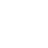

# K — Phosphor Icons

> **6 icons** in the **K** category.

<table>
  <thead>
    <tr>
      <th align="center" width="50"><strong>#</strong></th>
      <th align="center" width="60"><strong>Icon</strong></th>
      <th align="left"><strong>Name</strong></th>
      <th align="center" width="60"><strong>File</strong></th>
    </tr>
  </thead>
  <tbody>
    <tr><td align="center">1</td><td align="center"></td><td><code>kanban</code></td><td align="center"><a href="https://github.com/Haijo12/roblox-icons/blob/main/icons-pack/phosphor-pack/k/kanban.png">↗</a></td></tr>
    <tr><td align="center">2</td><td align="center"></td><td><code>key-return</code></td><td align="center"><a href="https://github.com/Haijo12/roblox-icons/blob/main/icons-pack/phosphor-pack/k/key-return.png">↗</a></td></tr>
    <tr><td align="center">3</td><td align="center"></td><td><code>key</code></td><td align="center"><a href="https://github.com/Haijo12/roblox-icons/blob/main/icons-pack/phosphor-pack/k/key.png">↗</a></td></tr>
    <tr><td align="center">4</td><td align="center"></td><td><code>keyboard</code></td><td align="center"><a href="https://github.com/Haijo12/roblox-icons/blob/main/icons-pack/phosphor-pack/k/keyboard.png">↗</a></td></tr>
    <tr><td align="center">5</td><td align="center"></td><td><code>keyhole</code></td><td align="center"><a href="https://github.com/Haijo12/roblox-icons/blob/main/icons-pack/phosphor-pack/k/keyhole.png">↗</a></td></tr>
    <tr><td align="center">6</td><td align="center"></td><td><code>knife</code></td><td align="center"><a href="https://github.com/Haijo12/roblox-icons/blob/main/icons-pack/phosphor-pack/k/knife.png">↗</a></td></tr>
  </tbody>
</table>
